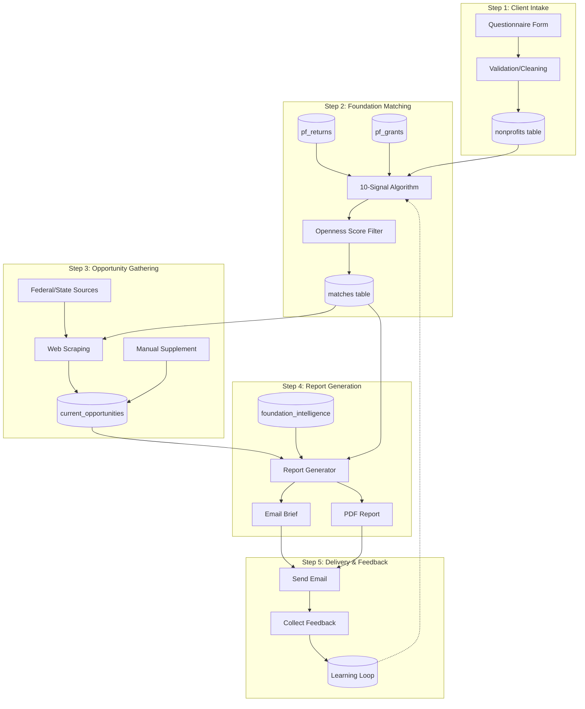

# WORKFLOW_SPEC.md - End-to-End Pipeline Specification

**Document Type:** SPEC
**Purpose:** End-to-end pipeline from new client to delivered report
**Version:** 1.0
**Date:** 2025-12-08
**Status:** DRAFT

---

## 1. Workflow Diagram

### ASCII Pipeline Overview

```
┌─────────────────────────────────────────────────────────────────────────────┐
│                      THEGRANTSCOUT PIPELINE                                 │
└─────────────────────────────────────────────────────────────────────────────┘

    ┌──────────┐     ┌──────────┐     ┌──────────┐     ┌──────────┐     ┌──────────┐
    │  INTAKE  │────▶│  MATCH   │────▶│  SCRAPE  │────▶│  REPORT  │────▶│  SEND    │
    └──────────┘     └──────────┘     └──────────┘     └──────────┘     └──────────┘
         │                │                │                │                │
         ▼                ▼                ▼                ▼                ▼
    ┌──────────┐     ┌──────────┐     ┌──────────┐     ┌──────────┐     ┌──────────┐
    │nonprofits│     │ matches  │     │ current_ │     │   PDF    │     │  Email   │
    │  table   │     │  table   │     │ grants   │     │  Report  │     │  Brief   │
    └──────────┘     └──────────┘     └──────────┘     └──────────┘     └──────────┘
                                                                              │
                                                                              ▼
                                                                        ┌──────────┐
                                                                        │ FEEDBACK │
                                                                        │   LOOP   │
                                                                        └──────────┘
```

### Mermaid Diagram



---

## 2. Step 1: Client Intake

### Questionnaire Fields Collected

The client intake questionnaire captures all information needed for matching and report generation.

| Field Category | Field Name | Required | Data Type | Purpose |
|---------------|------------|----------|-----------|---------|
| **Identity** | Organization Name | Yes | TEXT | Display name |
| **Identity** | Legal Name | No | TEXT | 990 lookup matching |
| **Identity** | EIN | Yes | VARCHAR(10) | Database linking |
| **Contact** | Contact Name | Yes | TEXT | Report recipient |
| **Contact** | Contact Email | Yes | EMAIL | Delivery address |
| **Contact** | Phone | No | VARCHAR(20) | Follow-up |
| **Location** | Address | No | TEXT | Geographic context |
| **Location** | City | Yes | TEXT | Geographic matching |
| **Location** | State | Yes | VARCHAR(2) | Primary geo filter |
| **Location** | ZIP | No | VARCHAR(10) | Local matching |
| **Financials** | Annual Budget | Yes | NUMERIC | Size alignment |
| **Financials** | Grant Request Range | Yes | TEXT | Amount matching |
| **Mission** | Mission Statement | Yes | TEXT | Purpose matching |
| **Mission** | Primary Focus Areas | Yes | TEXT[] | Sector alignment |
| **Mission** | NTEE Code | No | VARCHAR(10) | Classification |
| **Mission** | Programs/Services | Yes | TEXT | Detailed matching |
| **History** | Current Funders | No | TEXT[] | Exclusion list |
| **History** | Past Applications | No | TEXT[] | Avoid duplicates |
| **History** | Board Members | No | TEXT[] | Network analysis |
| **Preferences** | Geographic Scope | Yes | TEXT | Local/State/National |
| **Preferences** | Grant Types | Yes | TEXT[] | Operating/Program/Capital |
| **Preferences** | Report Preference | No | TEXT | Opportunity vs Foundation focus |

### How Data Enters nonprofits Table

```python
def intake_client(questionnaire_data: dict) -> int:
    """
    Process questionnaire and insert into nonprofits table.
    Returns: nonprofit_id
    """
    # 1. Validate required fields
    required = ['name', 'ein', 'contact_email', 'city', 'state',
                'annual_budget', 'mission_statement', 'focus_areas']
    for field in required:
        if not questionnaire_data.get(field):
            raise ValueError(f"Missing required field: {field}")

    # 2. Clean and normalize
    cleaned = {
        'ein': normalize_ein(questionnaire_data['ein']),
        'name': questionnaire_data['name'].strip(),
        'legal_name': questionnaire_data.get('legal_name'),
        'city': questionnaire_data['city'].strip().title(),
        'state': questionnaire_data['state'].upper()[:2],
        'annual_budget': parse_currency(questionnaire_data['annual_budget']),
        'mission_statement': questionnaire_data['mission_statement'],
        'focus_areas': parse_array(questionnaire_data['focus_areas']),
        'existing_funders': parse_array(questionnaire_data.get('current_funders', [])),
        'board_members': parse_array(questionnaire_data.get('board_members', []))
    }

    # 3. Enrich from IRS 990 if EIN provided
    if cleaned['ein']:
        irs_data = lookup_990_by_ein(cleaned['ein'])
        if irs_data:
            cleaned['ntee_code'] = irs_data.get('ntee_code')
            cleaned['total_revenue'] = irs_data.get('total_revenue')
            cleaned['tax_year'] = irs_data.get('tax_year')

    # 4. Generate mission keywords for matching
    cleaned['mission_keywords'] = extract_keywords(cleaned['mission_statement'])

    # 5. Insert into database
    nonprofit_id = db.insert('nonprofits', cleaned)

    return nonprofit_id
```

### Validation Rules

| Field | Validation | Error Action |
|-------|------------|--------------|
| EIN | 9 digits, numeric | Reject if invalid format |
| State | 2-letter code, valid US state | Reject if invalid |
| Email | Valid email format | Reject if invalid |
| Annual Budget | Positive number | Reject if negative or zero |
| Mission Statement | Min 50 characters | Request expansion |
| Focus Areas | At least 1 selected | Request selection |

---

## 3. Step 2: Foundation Matching

### Tables Queried

| Table | Schema | Purpose | Key Fields Used |
|-------|--------|---------|-----------------|
| pf_returns | f990_2025 | Foundation profiles | ein, state, total_assets_eoy_amt, grants_to_organizations_ind, only_contri_to_preselected_ind |
| pf_grants | f990_2025 | Grant history | filer_ein, recipient_name, recipient_state, amount, purpose, tax_year |
| officers | f990_2025 | Board connections | ein, person_nm, title_txt |
| nonprofits | public | Client profile | All fields for matching signals |

### Matching Script Logic

The matching algorithm implements the 10-signal scoring system documented in ALGORITHM_SPEC.md.

```python
def match_foundations_for_nonprofit(nonprofit_id: int) -> List[Dict]:
    """
    Run 10-signal matching algorithm for a nonprofit.
    Returns: List of foundation matches with scores
    """
    # 1. Load nonprofit profile
    nonprofit = db.get('nonprofits', nonprofit_id)

    # 2. Apply hard filters first (reduces from 85K to ~20K foundations)
    eligible_foundations = db.query("""
        SELECT * FROM f990_2025.pf_returns
        WHERE grants_to_organizations_ind = TRUE
          AND (only_contri_to_preselected_ind = FALSE
               OR only_contri_to_preselected_ind IS NULL)
          AND total_assets_eoy_amt > 100000  -- Minimum viable size
        ORDER BY total_assets_eoy_amt DESC
    """)

    # 3. Score each foundation
    matches = []
    for foundation in eligible_foundations:
        # Build foundation profile from grants
        profile = build_foundation_profile(foundation['ein'])

        # Calculate all 10 signals
        score = calculate_match_score(profile, nonprofit)

        # Apply openness filter
        if should_include_foundation(profile, nonprofit):
            matches.append({
                'foundation_ein': foundation['ein'],
                'nonprofit_id': nonprofit_id,
                'overall_score': score['overall_score'],
                'signal_breakdown': score['signal_breakdown'],
                'confidence': score['confidence'],
                'explanation': generate_match_explanation(profile, nonprofit, score)
            })

    # 4. Sort by score and return top N
    matches.sort(key=lambda x: x['overall_score'], reverse=True)
    return matches[:500]  # Top 500 for further processing
```

### 10-Signal Weights

| Signal | Weight | Calculation |
|--------|--------|-------------|
| Prior Relationship | 40% | Check if foundation has funded this nonprofit before |
| Geographic Match | 15% | Same state = 100, top 5 states = 75, adjacent = 50, regional = 25 |
| Grant Size Alignment | 12% | Compare nonprofit's ask to foundation's typical range |
| Repeat Funding Rate | 10% | Foundation's tendency to re-fund grantees |
| Portfolio Concentration | 8% | How focused foundation is on specific types |
| Purpose Text Match | 5% | Keyword overlap in mission vs grant purposes |
| Recipient Validation | 4% | How many other funders support this nonprofit |
| Foundation Size | 3% | Capacity alignment with nonprofit's budget |
| Regional Proximity | 2% | Same census region bonus |
| Grant Frequency | 1% | Active vs sporadic grantmaker |

### Output Format (matches table)

```sql
CREATE TABLE matches (
    id SERIAL PRIMARY KEY,
    nonprofit_id INTEGER REFERENCES nonprofits(id),
    foundation_ein VARCHAR(20) NOT NULL,
    overall_score NUMERIC(5,2),
    signal_breakdown JSONB,
    confidence_score NUMERIC(3,2),
    match_explanation TEXT,
    rank_within_nonprofit INTEGER,
    tier VARCHAR(20), -- 'excellent', 'good', 'moderate', 'weak'
    status VARCHAR(50) DEFAULT 'pending', -- 'pending', 'reviewed', 'included', 'excluded'
    created_at TIMESTAMP DEFAULT CURRENT_TIMESTAMP,
    reviewed_at TIMESTAMP,
    reviewed_by VARCHAR(100)
);

-- Indexes
CREATE INDEX idx_matches_nonprofit ON matches(nonprofit_id);
CREATE INDEX idx_matches_foundation ON matches(foundation_ein);
CREATE INDEX idx_matches_score ON matches(overall_score DESC);
CREATE INDEX idx_matches_tier ON matches(tier);
```

### Foundations Scored Per Client

| Stage | Count | Description |
|-------|-------|-------------|
| Total in Database | 85,470 | All foundations |
| After Hard Filters | ~20,000 | Makes grants to orgs, not preselected only |
| Fully Scored | ~20,000 | All signals calculated |
| Top Tier Matches | 500 | Stored in matches table |
| Report Candidates | 50-100 | Reviewed for report inclusion |
| Final Report | 5-10 | Included in delivered report |

---

## 4. Step 3: Opportunity Gathering

### Scraping Pipeline

```
┌─────────────────┐     ┌─────────────────┐     ┌─────────────────┐
│ Top 50 Matched  │────▶│  URL Discovery  │────▶│  Scrape Sites   │
│  Foundations    │     │  (from 990-PF)  │     │                 │
└─────────────────┘     └─────────────────┘     └─────────────────┘
                                                        │
                                                        ▼
┌─────────────────┐     ┌─────────────────┐     ┌─────────────────┐
│ Federal Sources │────▶│   Aggregate     │────▶│current_opportun-│
│ (Grants.gov)    │     │   & Dedupe      │     │    ities        │
└─────────────────┘     └─────────────────┘     └─────────────────┘
        │                       ▲
        │                       │
┌───────▼─────────┐            │
│  State Portals  │────────────┘
│                 │
└─────────────────┘
```

### current_opportunities Table Population

```python
def scrape_foundation_opportunities(foundation_ein: str) -> List[Dict]:
    """
    Scrape current grant opportunities from a foundation's website.
    """
    # 1. Get foundation website from 990-PF
    foundation = db.get('pf_returns', {'ein': foundation_ein})
    website_url = foundation.get('website_url')

    if not website_url or website_url in ['N/A', 'NONE', '0']:
        return []

    # 2. Attempt to find grants/apply page
    grants_urls = discover_grants_pages(website_url)

    # 3. Scrape each discovered page
    opportunities = []
    for url in grants_urls:
        page_content = fetch_page(url)
        extracted = extract_opportunity_data(page_content)

        if extracted:
            opportunities.append({
                'source': 'foundation_website',
                'source_url': url,
                'foundation_ein': foundation_ein,
                'title': extracted['title'],
                'description': extracted['description'],
                'funding_min': extracted.get('amount_min'),
                'funding_max': extracted.get('amount_max'),
                'deadline': parse_date(extracted.get('deadline')),
                'application_url': extracted.get('apply_url'),
                'contact_name': extracted.get('contact_name'),
                'contact_email': extracted.get('contact_email'),
                'eligibility': extracted.get('eligibility'),
                'scraped_at': datetime.now()
            })

    return opportunities
```

### Manual Supplement Process

When scraping is insufficient, research team manually adds opportunities:

1. **Trigger:** Foundation in top matches lacks scraped opportunities
2. **Research:** Team searches foundation website, news, LinkedIn
3. **Entry:** Manual entry via admin interface
4. **Verification:** Second team member verifies accuracy
5. **Quality Fields:**
   - `source = 'manual_research'`
   - `verified_at = timestamp`
   - `verified_by = researcher_name`

### Federal/State Grant Sources

| Source | URL | Update Frequency | Integration Method |
|--------|-----|------------------|-------------------|
| Grants.gov | grants.gov/api | Daily | API pull |
| SAM.gov | sam.gov | Weekly | API pull |
| State portals | Varies | Weekly | Web scraping |
| CFDA | cfda.gov | Monthly | CSV import |

### current_opportunities Schema

```sql
CREATE TABLE current_opportunities (
    id SERIAL PRIMARY KEY,
    grant_id VARCHAR(100) UNIQUE,
    source VARCHAR(50) NOT NULL,
    source_url TEXT NOT NULL,
    foundation_ein VARCHAR(20) REFERENCES foundations(ein),
    title VARCHAR(500) NOT NULL,
    description TEXT,
    funding_min INTEGER,
    funding_max INTEGER,
    total_funding_available BIGINT,
    program_areas TEXT,
    ntee_codes TEXT,
    eligible_applicants TEXT,
    geographic_restrictions TEXT,
    deadline DATE,
    application_url TEXT,
    contact_name VARCHAR(255),
    contact_email VARCHAR(255),
    contact_phone VARCHAR(20),
    scraped_at TIMESTAMP DEFAULT CURRENT_TIMESTAMP,
    verified_at TIMESTAMP,
    verified_by VARCHAR(100),
    expires_at TIMESTAMP,
    is_active BOOLEAN DEFAULT TRUE
);
```

---

## 5. Step 4: Report Generation

### Template Structure

#### Email Brief (1 page)

| Section | Purpose | Length |
|---------|---------|--------|
| Subject Line | Drive opens, show urgency | <60 chars |
| Opening | Orient, highlight critical action | 2-3 sentences |
| Top 5 Table | Scannable opportunity overview | 5 rows |
| Immediate Actions | Prioritized checklist | 4-5 items |
| What's in Full Report | Encourage PDF review | 3 bullets |
| Feedback Request | Beta period learning | 3 questions |

#### PDF Report (10-15 pages)

| Section | Content | Pages |
|---------|---------|-------|
| Header | Org name, date, urgency, total potential | 0.25 |
| One Thing | Single critical action | 0.25 |
| Executive Summary | Actions, scenarios, strengths | 0.5 |
| Top 5 Table | Master reference | 0.5 |
| Opportunity Deep Dives (x5) | Why fits, details, snapshot, strategy | 1.5 each (7.5 total) |
| 8-Week Timeline | Planning across all opportunities | 0.5 |
| Quick Reference | All contacts and portals | 0.5 |

### Where AI Is Used

| Component | AI Role | Input | Output |
|-----------|---------|-------|--------|
| Why This Fits | Generate match explanation | Match signals, client mission | 3-4 sentence narrative |
| Positioning Strategy | Data-driven recommendations | Funder Snapshot metrics | 3-4 sentence advice |
| Match Explanation | Explain score breakdown | Signal values | Human-readable explanation |
| Comparable Grant | Find similar recipient | Client profile, grant history | Example grant citation |

### PDF Creation Process

```python
def generate_report(nonprofit_id: int, week_number: int) -> bytes:
    """
    Generate PDF report for a nonprofit.
    Returns: PDF file bytes
    """
    # 1. Load data
    nonprofit = db.get('nonprofits', nonprofit_id)
    matches = db.query("""
        SELECT * FROM matches
        WHERE nonprofit_id = %s AND status = 'included'
        ORDER BY overall_score DESC LIMIT 5
    """, [nonprofit_id])

    opportunities = db.query("""
        SELECT co.*, m.overall_score, m.signal_breakdown
        FROM current_opportunities co
        JOIN matches m ON co.foundation_ein = m.foundation_ein
        WHERE m.nonprofit_id = %s AND m.status = 'included'
        ORDER BY co.deadline ASC NULLS LAST
    """, [nonprofit_id])

    # 2. Build report data structure
    report_data = {
        'nonprofit': nonprofit,
        'week_number': week_number,
        'report_date': date.today(),
        'opportunities': []
    }

    for opp in opportunities[:5]:
        foundation = db.get('pf_returns', {'ein': opp['foundation_ein']})
        snapshot = calculate_funder_snapshot(opp['foundation_ein'])

        report_data['opportunities'].append({
            'opportunity': opp,
            'foundation': foundation,
            'snapshot': snapshot,
            'why_fits': generate_why_fits(nonprofit, opp, foundation),
            'positioning': generate_positioning_strategy(nonprofit, snapshot),
            'next_steps': generate_next_steps(opp)
        })

    # 3. Calculate summary metrics
    report_data['total_potential'] = sum(
        o['opportunity']['funding_max'] or 0 for o in report_data['opportunities']
    )
    report_data['urgent_count'] = sum(
        1 for o in report_data['opportunities']
        if o['opportunity']['deadline'] and
           o['opportunity']['deadline'] <= date.today() + timedelta(days=30)
    )

    # 4. Generate Markdown from template
    markdown = render_template('weekly_report_template.md', report_data)

    # 5. Convert to PDF
    pdf_bytes = markdown_to_pdf(markdown)

    return pdf_bytes
```

### Quality Checks Before Delivery

| Check | Method | Failure Action |
|-------|--------|----------------|
| Deadlines current | Verify within past 7 days | Update or exclude |
| Links working | HTTP HEAD request | Fix or remove |
| Amounts accurate | Compare to source | Correct |
| No client's existing funders | Check exclusion list | Remove |
| Foundation actively giving | Check last grant year | Exclude if >3 years |
| Spelling/grammar | Spell-check tool | Fix |
| Dollar formatting | Regex validation | Reformat |
| No duplicates | Unique EIN check | Remove |

---

## 6. Step 5: Delivery & Feedback

### Email Sending Mechanism

```python
def send_report(nonprofit_id: int, report_pdf: bytes, email_brief: str):
    """
    Send weekly report via email.
    """
    nonprofit = db.get('nonprofits', nonprofit_id)

    # 1. Prepare email
    email = {
        'to': nonprofit['contact_email'],
        'from': 'research@thegrantscout.com',
        'subject': generate_subject_line(nonprofit, report_data),
        'html_body': render_email_template(email_brief),
        'attachments': [
            {
                'filename': f"{nonprofit['name']}_Week{week}_Report.pdf",
                'content': report_pdf,
                'content_type': 'application/pdf'
            }
        ]
    }

    # 2. Send via Brevo API
    response = brevo_client.send_email(email)

    # 3. Log delivery
    db.insert('delivery_log', {
        'nonprofit_id': nonprofit_id,
        'sent_at': datetime.now(),
        'email_id': response['message_id'],
        'status': 'sent',
        'week_number': week_number
    })

    return response['message_id']
```

### Feedback Collection Process

| Stage | Timing | Method | Data Captured |
|-------|--------|--------|---------------|
| Initial Response | 24-48 hours | Email reply | Quick reactions |
| Structured Survey | End of week | Google Form | Ratings, suggestions |
| Phone Call | Monthly | Scheduled call | Deep feedback |
| Outcome Tracking | 3-6 months | Follow-up survey | Application/award results |

### Feedback Database Schema

```sql
CREATE TABLE feedback (
    id SERIAL PRIMARY KEY,
    nonprofit_id INTEGER REFERENCES nonprofits(id),
    report_week INTEGER,
    submitted_at TIMESTAMP DEFAULT CURRENT_TIMESTAMP,

    -- Per-opportunity ratings
    opportunity_ratings JSONB, -- {ein: {usefulness: 1-5, will_pursue: bool}}

    -- Overall report feedback
    report_usefulness INTEGER CHECK (report_usefulness BETWEEN 1 AND 5),
    discovery_value INTEGER CHECK (discovery_value BETWEEN 1 AND 5),

    -- Open-ended
    most_valuable TEXT,
    least_valuable TEXT,
    suggestions TEXT,
    additional_funders_requested TEXT,

    -- Outcomes (updated later)
    applications_submitted JSONB, -- {ein: {submitted_at, amount_requested}}
    awards_received JSONB -- {ein: {awarded_at, amount_received}}
);
```

### Learning Loop (How Feedback Improves Algorithm)

```
┌─────────────────┐     ┌─────────────────┐     ┌─────────────────┐
│    Feedback     │────▶│    Analysis     │────▶│  Weight Adjust  │
│    Collection   │     │    Dashboard    │     │                 │
└─────────────────┘     └─────────────────┘     └─────────────────┘
         │                       │                       │
         ▼                       ▼                       ▼
┌─────────────────┐     ┌─────────────────┐     ┌─────────────────┐
│ Track: pursued, │     │ Correlation:    │     │ Signal weights  │
│ awarded, rating │     │ score vs outcome│     │ via regression  │
└─────────────────┘     └─────────────────┘     └─────────────────┘
```

**Learning Metrics Tracked:**
- Correlation between match score and user pursuit rate
- Correlation between match score and award rate
- Signal-by-signal effectiveness (which signals predict success?)
- False positive rate (highly scored but not useful)
- False negative rate (low scored but would have been useful)

---

## 7. Required Tables

### Core Pipeline Tables

| Table | Schema | Purpose | Key Fields | Dependencies |
|-------|--------|---------|------------|--------------|
| nonprofits | public | Client profiles | ein, name, state, mission | None (root) |
| pf_returns | f990_2025 | Foundation profiles | ein, state, assets, grants_to_orgs | IRS import |
| pf_grants | f990_2025 | Historical grants | filer_ein, recipient, amount, purpose | pf_returns |
| officers | f990_2025 | Board members | ein, person_nm, title | pf_returns |
| matches | public | Match results | nonprofit_id, foundation_ein, score | nonprofits, pf_returns |
| current_opportunities | public | Active grants | foundation_ein, deadline, amount | Scraping |
| foundation_intelligence | public | Enriched profiles | ein, openness_score, giving_patterns | pf_grants analysis |
| delivery_log | public | Email tracking | nonprofit_id, sent_at, status | nonprofits |
| feedback | public | User feedback | nonprofit_id, ratings, outcomes | nonprofits |

### Table Relationships

```
nonprofits (1) ───────────────── (*) matches
                                      │
                                      │
pf_returns (1) ─────────────────(*) matches
      │
      ├──────── (1) ──────── (*) pf_grants
      │
      └──────── (1) ──────── (*) officers

pf_returns (*) ─────────────────(*) current_opportunities
                  (via foundation_ein)

matches (*) ──────────────────── (1) current_opportunities
              (via foundation_ein)

nonprofits (1) ─────────────────(*) feedback
nonprofits (1) ─────────────────(*) delivery_log
```

---

## 8. Required Scripts

### Data Pipeline Scripts

| Script | Path | Purpose | Inputs | Outputs | Frequency |
|--------|------|---------|--------|---------|-----------|
| import_f990.py | 1. Database/F990-2025/1. Import/ | Import IRS XML data | ZIP files from IRS | pf_returns, pf_grants, officers | Annual + quarterly updates |
| backfill_grant_purpose.py | 1. Database/F990-2025/1. Import/ | Fix missing purpose text | XML files | pf_grants.purpose | One-time fix |
| validate.py | 1. Database/F990-2025/1. Import/ | Validate import quality | Database tables | Validation report | After each import |

### Matching Scripts (To Be Built)

| Script | Purpose | Inputs | Outputs | Frequency |
|--------|---------|--------|---------|-----------|
| build_foundation_profiles.py | Pre-calculate foundation analytics | pf_grants | foundation_intelligence | Weekly batch |
| run_matching.py | Execute 10-signal algorithm | nonprofit_id | matches table | Per client |
| calculate_openness.py | Score foundation openness | pf_returns, pf_grants | foundation_intelligence.openness_score | Weekly batch |

### Scraping Scripts (To Be Built)

| Script | Purpose | Inputs | Outputs | Frequency |
|--------|---------|--------|---------|-----------|
| scrape_foundation_websites.py | Extract grant opportunities | Foundation URLs | current_opportunities | Weekly |
| scrape_grants_gov.py | Pull federal opportunities | Grants.gov API | current_opportunities | Daily |
| scrape_state_portals.py | Pull state opportunities | Portal URLs | current_opportunities | Weekly |
| validate_opportunities.py | Verify deadlines/links | current_opportunities | Updated statuses | Daily |

### Reporting Scripts (To Be Built)

| Script | Purpose | Inputs | Outputs | Frequency |
|--------|---------|--------|---------|-----------|
| generate_weekly_report.py | Create PDF report | matches, opportunities | PDF file | Per client/week |
| generate_email_brief.py | Create email summary | Report data | HTML email | Per client/week |
| send_reports.py | Deliver via email | Report files | delivery_log entries | Per client/week |

### Learning Loop Scripts (Future)

| Script | Purpose | Inputs | Outputs | Frequency |
|--------|---------|--------|---------|-----------|
| analyze_feedback.py | Compute feedback metrics | feedback table | Analytics dashboard | Weekly |
| update_signal_weights.py | Adjust algorithm weights | feedback outcomes | Algorithm parameters | Monthly |
| track_outcomes.py | Record application results | User submissions | feedback.outcomes | Ongoing |

---

## 9. Source Files

### Existing Code

| File | Path | Description |
|------|------|-------------|
| import_f990.py | /1. Database/F990-2025/1. Import/import_f990.py | Main IRS XML import script |
| schema.sql | /1. Database/F990-2025/1. Import/schema.sql | Database schema definition |
| validate.py | /1. Database/F990-2025/1. Import/validate.py | Import validation checks |
| backfill_grant_purpose.py | /1. Database/F990-2025/1. Import/backfill_grant_purpose.py | Fix missing grant purposes |
| config.yaml | /1. Database/F990-2025/1. Import/config.yaml | Import configuration |

### Templates

| File | Path | Description |
|------|------|-------------|
| Email Brief Template | /2. Beta Testing/1. Reports/Round 2/Report Templates/SPEC_2025-12-01_email_brief_template.md | Email format spec |
| Weekly Report Template | /2. Beta Testing/1. Reports/Round 2/Report Templates/SPEC_2025-12-01_weekly_report_template.md | PDF report format |
| Report Section Definitions | /2. Beta Testing/1. Reports/Round 2/Report Templates/SPEC_2025-12-01_report_section_definitions.md | Detailed field specs |

### Related Specs

| File | Path | Description |
|------|------|-------------|
| ALGORITHM_SPEC.md | /0. The Grant Scout Specs/ALGORITHM_SPEC.md | 10-signal algorithm details |
| DATA_DICTIONARY.md | /1. Database/DATA_DICTIONARY.md | Full database documentation |
| CLAUDE.md | /.claude/CLAUDE.md | Project context and conventions |
| Build Plan.md | /1. Database/Build Plan.md | Original build roadmap |

### Agent Definitions

| File | Path | Description |
|------|------|-------------|
| reporter.md | /.claude/agents/reporter.md | Report generation agent spec |
| scout.md | /.claude/agents/scout.md | Data discovery agent |
| analyst.md | /.claude/agents/analyst.md | Analysis agent |
| validator.md | /.claude/agents/validator.md | Quality assurance agent |

---

## 10. Current Status Summary

### What's Built

| Component | Status | Notes |
|-----------|--------|-------|
| IRS Import | Complete | 85,470 foundations, 1.6M grants |
| Database Schema | Complete | f990_2025 schema operational |
| Algorithm Design | Complete | 10-signal spec documented |
| Report Templates | Complete | Email brief + PDF templates defined |

### What's In Progress

| Component | Status | Blocker |
|-----------|--------|---------|
| Foundation Profiles | Partial | Needs openness score calculation |
| Matching Script | Designed | Needs implementation |
| Report Generation | Manual | Needs automation |

### What's Needed

| Component | Priority | Effort | Dependencies |
|-----------|----------|--------|--------------|
| run_matching.py | High | Medium | Foundation profiles |
| calculate_openness.py | High | Low | pf_returns, pf_grants |
| generate_weekly_report.py | High | Medium | Matching script |
| scrape_foundation_websites.py | Medium | High | Foundation URLs |
| send_reports.py | Medium | Low | Report generation |
| analyze_feedback.py | Low | Medium | Feedback collection |

---

## Appendix A: Environment Setup

### Database Connection

```python
import psycopg2

db_conn = psycopg2.connect(
    host='172.26.16.1',
    port=5432,
    database='postgres',
    user='postgres',
    password='<see 1. Database/Postgresql Info.txt>'
)
```

### Key Paths

| Item | Path |
|------|------|
| Database credentials | C:\TheGrantScout\1. Database\Postgresql Info.txt |
| Schema definition | C:\TheGrantScout\1. Database\F990-2025\1. Import\schema.sql |
| Import scripts | C:\TheGrantScout\1. Database\F990-2025\1. Import\ |
| Report templates | C:\TheGrantScout\2. Beta Testing\1. Reports\Round 2\Report Templates\ |
| Specs | C:\TheGrantScout\0. The Grant Scout Specs\ |

---

## Appendix B: Changelog

| Date | Version | Changes |
|------|---------|---------|
| 2025-12-08 | 1.0 | Initial workflow specification |

---

**Document Status:** DRAFT
**Next Review:** After first automated pipeline run
**Owner:** TheGrantScout Dev Team
